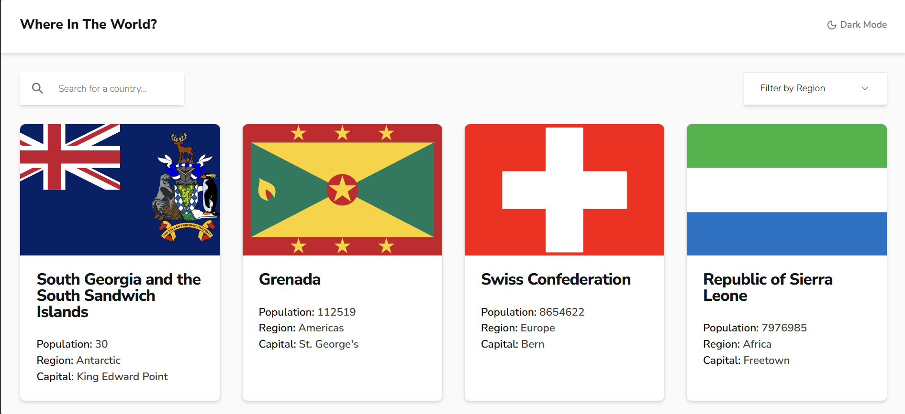

# Frontend Mentor - REST Countries API 與顏色主題切換器

## Table of contents

- [概覽](#概覽)
  - [挑戰](#挑戰)
  - [截圖](#截圖)
  - [連結](#連結)
- [我的過程](#我的過程)
  - [建置工具](#建置工具)
  - [學習到的](#學習到的)
  - [未來開發計畫](#未來開發計畫)
  - [資源](#資源)
- [作者](#作者)
- [致謝](#致謝)

## 概覽

### 挑戰

使用者應該能夠：

- 在首頁顯示來自 API 的所有國家資料。
- 使用搜尋框來搜尋國家。
- 按地區篩選國家。
- 點擊國家查看詳細資料，並跳轉到單獨頁面。
- 在詳細頁面中點擊查看邊界國家。

### 截圖

### 連結

- Live Site URL: [Add live site URL here](https://country-theme.vercel.app/)
- Solution URL: [Add solution URL here](https://github.com/Hakxep-wuqpuk-hyrze8/country-theme)

## 我的過程

### 建置工具

- Semantic HTML5 markup
- CSS custom properties
- Flexbox
- CSS Grid
- [React](https://reactjs.org/) - 用於建立使用者介面的 JavaScript 庫
- [Next.js](https://nextjs.org/) - 用於構建伺服器端渲染應用的 React 框架
- [Tailwind CSS](https://tailwindcss.com/) - 一個實用的 CSS 框架
- [@tanstack/query](https://tanstack.com/) - 用於 React 的數據抓取和狀態管理解決方案
- [Hono](https://hono.dev/) - 輕量級且高效的 API 框架
- [nuqs](https://nuqs.47ng.com/) - 用於 React 的全域狀態管理
- [shadcn/ui](https://ui.shadcn.com/) - 用於構建樣式化介面的 UI 組件庫

### 學習到的

在這個專案中，我學到了幾個有價值的概念和工具：

- 使用 @tanstack/query 進行數據抓取：我使用它來抓取國家資料並處理不同的加載狀態，同時管理 React 應用中的遠端數據。
- 使用 nuqs 進行全域狀態管理：我學會了使用 nuqs 來管理 React 應用中的全域狀態，提供了一種輕鬆同步多個元件狀態的方式。
- 使用 useDebounce 實現防抖邏輯：我使用 useDebounce 來提高搜尋輸入效率，減少不必要的 API 請求，並通過等待用戶停止輸入後再發送請求來提升性能。
- 使用 Hono 框架構建 API：我將 Hono 框架與 @tanstack/query 結合，快速搭建了 API 路由和請求處理，使其運行更加高效。

### 未來開發計畫

未來，我計劃：

- 實現光明/黑暗模式切換功能，讓使用者可以根據個人喜好選擇顯示模式，提升使用者體驗。
- 改善可及性和移動設備的響應式設計，確保應用在各設備上的流暢運行。
- 擴展應用功能，例如根據人口、面積等條件排序國家。
- 進一步探索 @tanstack/query，改善快取管理、分頁和伺服器端狀態的處理。

### 資源

- Integrate and Customize Tailwind CSS Dark Mode in a Next.js Project [Link](https://prismic.io/blog/tailwind-css-darkmode-tutorial)

## 作者

- Frontend Mentor - [@Hakxep-wuqpuk-hyrze8](https://www.frontendmentor.io/profile/Hakxep-wuqpuk-hyrze8)

## 致謝

非常感謝 Frontend Mentor 社群提供如此完整且實用的挑戰，